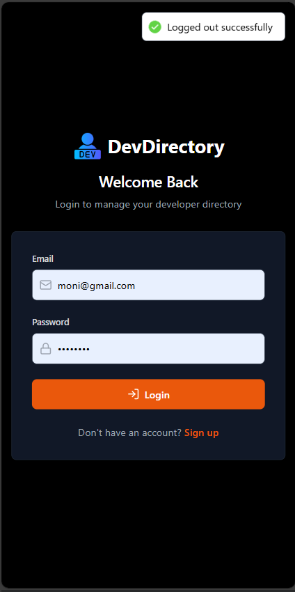
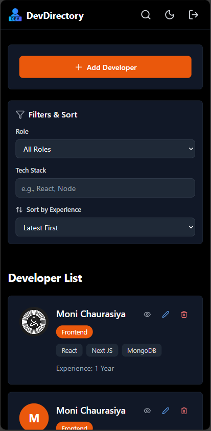
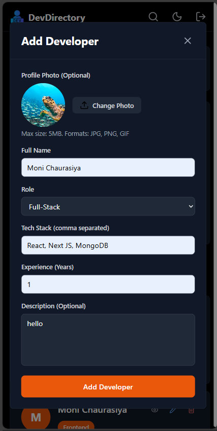
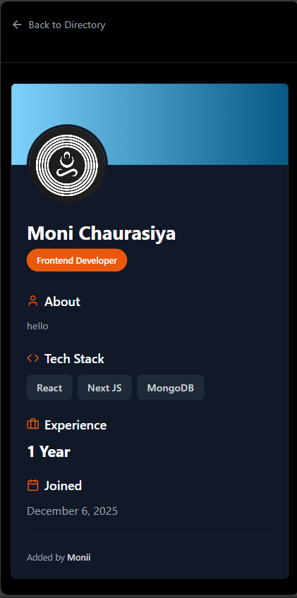

# DevDirectory - Developer Management System

A modern, full-stack developer directory application with dark/light mode, search, and filter capabilities.

## 📸 Screenshots

### Desktop View - Dark Mode


### Desktop View - Light Mode


### Mobile View
<p align="center">
  
  
</p>

<p align="center">
  
  
</p>

## 🛠️ Tech Stack

### Frontend
- React 18
- Vite
- Tailwind CSS
- React Hook Form
- Zod (validation)
- Context API (theme management)
- React Hot Toast
- Lucide React (icons)
- Axios

### Backend
- Node.js
- Express.js
- MongoDB
- Mongoose
- CORS
- dotenv

## 🚀 Quick Setup

### Prerequisites
- Node.js (v16+)
- MongoDB (local or Atlas)
- npm or yarn

### Backend Setup

1. Navigate to backend folder and install dependencies:
```bash
cd backend
npm install
```

2. Create `.env` file in `backend/` folder:
```env
PORT=5000
MONGODB_URI=mongodb://localhost:27017/devdirectory
JWT_SECRET=my_super_secret_key_for_devdirectory
FRONTEND_URL=https://developer-directory-kappa.vercel.app
```

3. Start the server:
```bash
npm run dev
```

Backend runs on: `http://localhost:5000`

### Frontend Setup

1. Navigate to frontend folder and install dependencies:
```bash
cd frontend
npm install
```

2. Create `.env` file in `frontend/` folder:
```env
VITE_API_URL=http://localhost:5000/api
OR
VITE_API_URL=https://developer-directory-6idf.onrender.com/api
```

3. Start the development server:
```bash
npm run dev
```

Frontend runs on: `http://localhost:5173`

## 🌐 Deployment

### Backend Deployment URL
```
https://developer-directory-6idf.onrender.com/
```


### Frontend Deployment URL
```
https://developer-directory-kappa.vercel.app/
```


## 📋 Features

✅ Add developers with form validation  
✅ Search by name  
✅ Filter by role (Frontend/Backend/Full-Stack)  
✅ Filter by tech stack or experience  
✅ Dark/Light mode toggle  
✅ Fully responsive design  
✅ Toast notifications  
✅ Modern UI with Tailwind CSS  


**Made with ❤️ using React vite + Node.js + MongoDB**